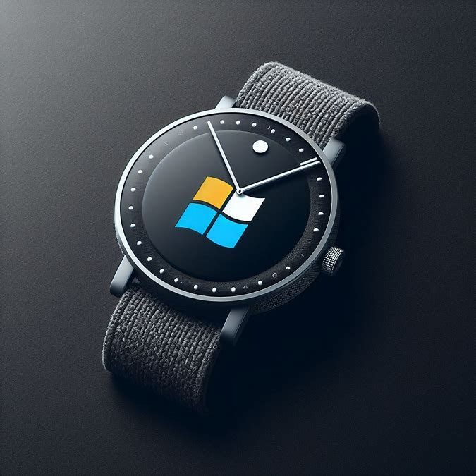
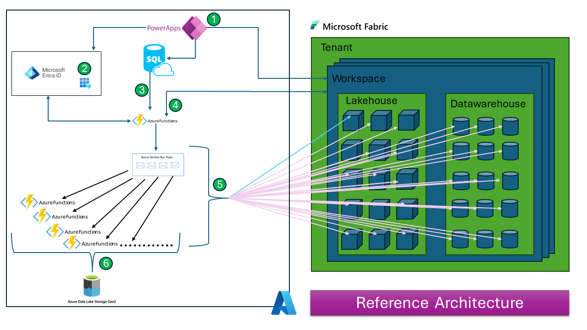
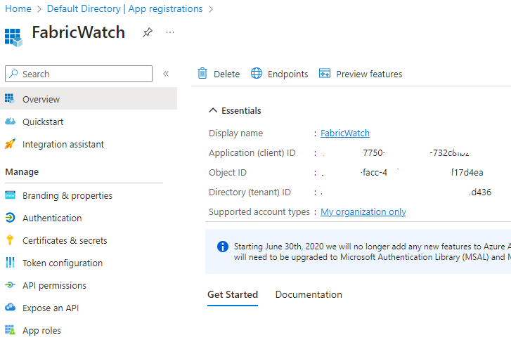
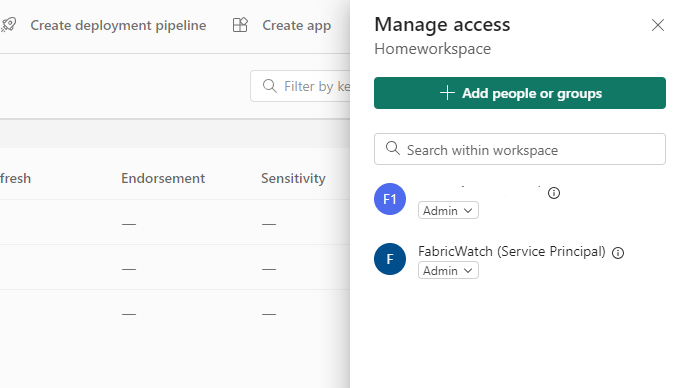
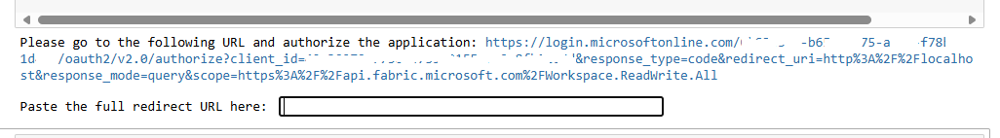
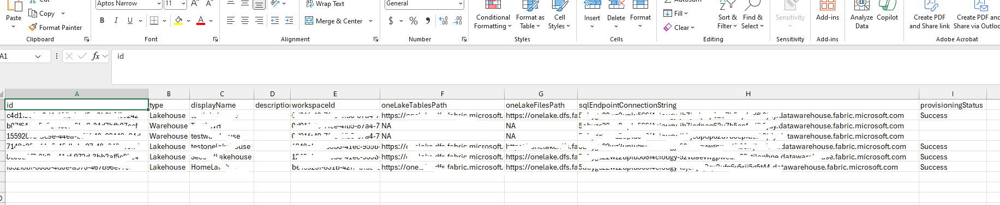
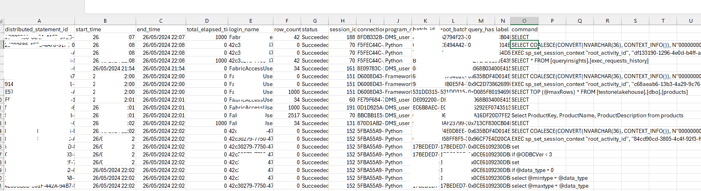

# FabricWatch  

## Introduction 
In today's digital age, businesses generate and manage vast amounts of data daily. This data is crucial for various operations, decision-making processes, and strategic planning. However, managing such extensive data comes with its own set of challenges and responsibilities. One of the key responsibilities is to monitor the activities surrounding this data. 

## Business Requirement and Challenge

Every organization needs to capture the queries executed against the data for audit and compliance perspectives. Microsoft Fabric is a SaaS platform that provides comprehensive monitoring and logging capabilities. Organizations can leverage these features to monitor activities within the Fabric platform. For example:

1. [Track user activities](https://learn.microsoft.com/en-us/fabric/admin/track-user-activities)
2. [Admin Monitoring workspace](https://learn.microsoft.com/en-us/fabric/admin/monitoring-workspace)
3. [Monitoring Hub](https://learn.microsoft.com/en-us/fabric/admin/monitoring-hub)
4. [Capacity Metric App](https://learn.microsoft.com/en-us/fabric/enterprise/metrics-app)
5. [API](https://learn.microsoft.com/en-us/rest/api/fabric/articles/)

### The Challenge

Currently, Datawarehouse and Lakehouse logs are retained in the platform for 30 and 60 days, respectively. Organizations often need to retain this data for longer periods. However, manually storing these logs is a tedious task. The steps involved typically include:

1. Connecting to all the workspaces
2. Connecting to all the Lakehouse and Datawarehouse endpoints
3. Querying the view (`queryinsights.exec_request_history`)
4. Storing all the logs in a centralized location

To address this challenge, we can utilize Azure services and Fabric APIs to automate the process. Hopefully, this capability will be available directly on the platform in the future. 

In the next section, let's explore how to automate this scenario.

## Reference Architecture 

Below is one of the reference architectures to automate the solution. This can be change based on the requirement. 




## Prerequisite 
1. [Register a client application in Microsoft EntraID](https://learn.microsoft.com/en-us/azure/healthcare-apis/register-application)

Once you register the client application, here how it will look like 



2. Assigning roles at the workspace level is required to query the Lakehouse and Warehouse SQL endpoints. The role assignment can be done in step number 1 (in the reference architecture) via [Workspaces - Add Workspace Role Assignment API](https://learn.microsoft.com/en-us/rest/api/fabric/core/workspaces/add-workspace-role-assignment?tabs=HTTP) . Generally, the Contributor role is sufficient to read the SQL endpoints. However, in an enterprise team, the Administrator role may be applied to perform other activities. For more information, please refer to [Roles in workspaces in Microsoft Fabric](https://learn.microsoft.com/en-us/fabric/get-started/roles-workspaces) for more information. Here is what the configuration looks like.



## Code Explaination 

This section will focus on the core part of the solution which is connecting to Microsoft Fabric environment and get all the logs from the respective endpoints. In this blog post I am not spining Azure services like function, storage etc but I am using my local environment. Microsoft documentation are pretty good in explaing on how to setup those services.  

The first part of the code (step 4 from the reference architecture) calls the get_authorization function to retrieve the token. As of today, this API requires user context; however, in the future, this will be achievable via a service principal. In the next piece of code, the program calls the Microsoft API to get the Lakehouse and Datawarehouse endpoints for a given workspace ID.

```python 
    # Get authorization code from user
        authorization_code = get_authorization_code()
        
        # Exchange the authorization code for access and refresh tokens
        token_response = get_tokens(authorization_code)
        
        # Extract the access token from the response
        access_token = token_response['access_token']
        
        # List of workspace IDs (for example purposes)
        workspace_ids = ['workspace-id-1','workspace-id-2','workspace-id-3']
         all_data = []

        for workspace_id in workspace_ids:
            lakehouse_response = call_lakehouse_api(workspace_id, access_token)
            warehouse_response = call_warehouse_api(workspace_id, access_token)
```

After retrieving the response from the API, the next step is to store the responses (which contain SQL endpoints information) in a CSV file. However, the same information can be sent to an Azure Service Bus Topic so that each function can pick up the SQL endpoint and start querying the endpoint. Here is the code snippet.

```python
for lakehouse in lakehouse_response['value']:
                lakehouse_data = {
                    'id': lakehouse['id'],
                    'type': lakehouse['type'],
                    'displayName': lakehouse['displayName'],
                    'description': lakehouse['description'],
                    'workspaceId': lakehouse['workspaceId'],
                    'oneLakeTablesPath': lakehouse['properties']['oneLakeTablesPath'],
                    'oneLakeFilesPath': lakehouse['properties']['oneLakeFilesPath'],
                    'sqlEndpointConnectionString': lakehouse['properties']['sqlEndpointProperties']['connectionString'],
                    'provisioningStatus': lakehouse['properties']['sqlEndpointProperties']['provisioningStatus']
                }
                all_data.append(lakehouse_data)
            for warehouse in warehouse_response['value']:
                warehouse_data = {
                    'id': warehouse['id'],
                    'type': warehouse['type'],
                    'displayName': warehouse['displayName'],
                    'description': warehouse['description'],
                    'workspaceId': warehouse['workspaceId'],
                    'oneLakeTablesPath':'NA',
                    'oneLakeFilesPath': 'NA',
                    'sqlEndpointConnectionString': warehouse['properties']['connectionInfo']
                }
                all_data.append(warehouse_data)
        
        # Save all collected data to a CSV file
        save_to_csv(all_data)
        print('All information is saved in a CSV File')

```
Cell execution will prompt for redirect url



Once the redirect URL is provided, it will store the output file in the specified directory.



The second part of the code connects to each SQL endpoint, queries [queryinsights].[exec_requests_history], and stores the results.

```python 
def main():

    csv_file = 'output.csv'
    query = "SELECT * FROM [queryinsights].[exec_requests_history]"
    
    connections = read_connection_details(csv_file)

    for i, conn_details in enumerate(connections):
        
        output_file = f'query_results_{i+1}.csv'
        print(conn_details['connection_string'])
        print(conn_details['database_name'])
        print(output_file)
        execute_query_and_save_to_csv(
            conn_details['connection_string'],
            conn_details['database_name'],
            query,
            output_file
        )

if __name__ == '__main__':
    main()

```
Execute the code and it will generate following output. 




The source code can be found under the [codefile directory](./codefile/FabricWatch.ipynb). 

## Summary 

In this blog post, we discussed the importance of monitoring and logging activities within Microsoft Fabric. We highlighted the business requirement and the challenges of retaining Datawarehouse and Lakehouse logs beyond their default retention periods. To address these challenges, we proposed an automated solution using Azure services and Fabric APIs.

Thanks you!!!! 